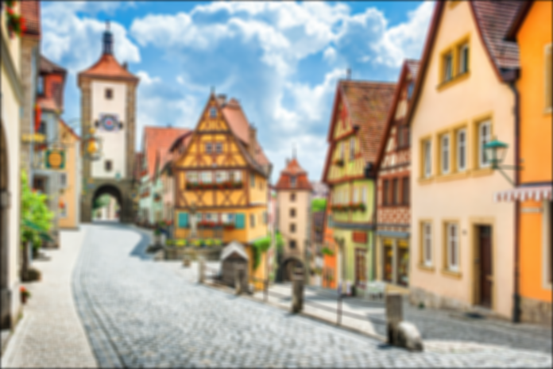

# filters
> Image filters.
This is a repository for exploring image filters in digital image processing.

## Bilateral filter
|Bilateral(3, 5)|Gaussian(3)|Original|
|--|--|--|
||||

Edges are preserved in bilateral filtered images when using the same spatial kernal sigma.
